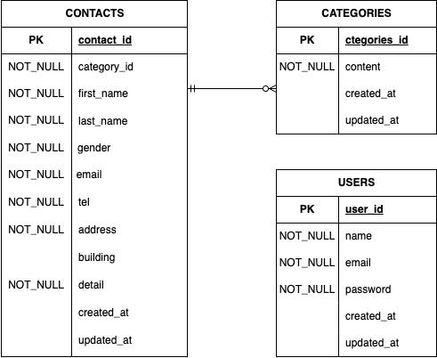

## 確認テスト_お問い合わせフォーム


FashionablyLate  
## 概要  
このプロジェクトは、Laravelを用いたWebsプリケーション開発の一環として実装されたお問い合わせフォーム機能です。  
ユーザーからのお問い合わせを受け付け、バリデーション、確認画面の表示、データベースへの保存までの一連のフローを構築します。  
(現段階の実装)  
  
## 動作環境  
OS:macOS  
必須ツール:  
・Docker Desktop  
・Docker Compose

## 環境構築  
このプロジェクトはDocker Compose を利用したコンテナ環境で動作します。  
  
### 前提条件  
*Docker / Docker Compose がインストールされていること。  
*Git がインストールされていること。  
  
### セットアップ手順  
  
リポジトリのクローン  
```bash
git clone git clone git@github.com:Ayana-del/ayana-kadai1.git
```  
```bash  
cd ayana-kadai1
```  
コンテナの起動
```bash
docker-compose up -d --build
```  
PHPコンテナのログインと初期設定  
```bash
docker-compose exec php bash
```  
依存パッケージのインストール
```bash
composer install
```  
環境ファイルのコピー  
```bash
cp .env.example .env
```
アプリケーションキーの生成  
```bash
php artisan key:generate
```  
データベースのセットアップ  
マイグレーションと初期データ（カテゴリ）の投入  
```bash
php artisan migrate:fresh --seed
```  
  
  
### アクセス  
アプリケーションは以下のURLでアクセス可能です。  
| 画面 | URL |  
| **データベース管理** | 'http://localhost:8080'  
| **入力画面** | 'http://localhost/' |  
| **確認画面** | 'http://localhost/confirm/' |  
| **ログイン画面** | 'http://localhost/login/' |  
| **ユーザー登録画面** | 'http://localhost/register/' |  
| **管理画面（お問い合わせ一覧）** | 'http://localhost/admin'/  

  
  
###　現在の実装機能  
  
現在のコミットで以下の機能が実装され、動作確認が完了しています。  
### 1.お問い合わせ入力画面('/')  
* **ルーティング**: 'GET/'は 'ContactController@index'にルーティングされます。  
* **データ取得**: 'Category' モデルからお問い合わせ種類（カテゴリ）を全て取得し、全て取得し、表示します。  
* **デザイン**: 'common.css', 'contact.css'のスタイルが適用されています。  
  
### 2.確認画面の遷移とバリデーション('POST /confirm')  
* **ルーティング**: 'POST /confirm' は、'ContactController@confirmOrSend'にルーティングされます。  
* **バリデーション**:'ContactRequest'を使用し、以下のルールーに基づいて入力データを厳格に検証します。  
    *必須項目チェック（’required’）  
    *形式チェック('email', 'regex', 'tel')  
    *文字数制限('max:8,max:120' など)  
    *外部キーチェック('exists:categories,id')  
* **エラー処理**: バリデーションエラーが発生した場合、入力した内容はそのまま自動で入力画面にリダイレクトされ、エラーメッセージを表示  
* **データ整形**:電話番号のハイフン除去、性別コード(1,2,3)から文字列への変換など、確認画面のデータを実行します。  
* **セッション管理**:検証済みの入力データをセッション('contact_data')に一時保存します。  
### 3.完了画面の遷移(’GET /thanks')  
* **ルーティング**:処理成功後、Route：:get('/thanks)は、ContactController＠thanksにリダイレクトされます。  
* **目的**:POSTrクエスト直後の画面でリロードが実行されることによる二重送信を防ぐため、POST後の処理は常にGETルートへのリダイレクトで完了します。  
* **表示**:お問い合わせの受付が完了したことをユーザーに伝えるメッセージを表示します。  
### 4.ログイン認証機能(/login)  
* **使用技術**:Laravel Fortifyを利用して認証機能を実装します。  
* **管理者**:事前に登録された会員登録情報（メールアドレス・ハッシュ化されたパスワード）を使用してログインできます。  
### 入力フォーム必要情報  
* **メールアドレス**:入力必須  
* **パスワード**:入力必須(データベースではハッシュ化)  
### 入力フォームバリデーション  
* **使用技術**:FormRequestを使用した厳格な入力検証。  
* **表示**:バリデーションエラー発生時、「ログイン」ボタンをクリックした際に、各項目の下に赤色のエラーメッセージを表示。  
### ユーザー認証動線  
1.バリデーションエラーがなければ、「ログイン」ボタンをクリック後、管理画面（http://localhost/admin）へ遷移します。  
2.ログインページのヘッダーの「register」ボタンからユーザー登録ページへ遷移できます。  
  
### 5.ユーザー登録機能  (/register)  
* **名前**:入力必須  
* **メールアドレス**:入力必須（一意であること）  
* **パスワード**:入力必須(ハッシュ化して保存)  
* **パスワード確認**:入力必須（パスワードと一致すること）Laravel Fortifyに必要な機能なのでそのまま残しています。

### 6.管理画面（/admin）  
* **表示情報**:お名前、性別、メールアドレス、お問い合わせ内容を表示します。  
* **ページネーション**:取得情報を７件ごとにページネーションをかけて表示します。  
* **ホバー機能**:テーブルの各列にカーソルが乗った際、行全体がハイライトされるホバー機能を実装します。  
  
* **お問い合わせ内容検索**:以下の項目を組み合わせて検索・絞り込みが可能です。  
* **名前**:姓、名、フルネームでの全部一致・部分一致検索が可能。  
* **メールアドレス**:全部一致・部分一致検索が可能。  
* **性別**:「全て」「男性」「女性」「その他」から選択可能。  
* **お問い合わせの種類**:５種類（商品のお届け・商品交換・商品トラブル・ショップへのお問い合わせ、その他）から選択可能。  
* **日付**:カレンダー入力(input[type="date"])を使用。  
  
・検索欄が全て入力された状態、または全てブランク状態、どちらでも検索が実行できます。  
・リセットボタンをクリックすると、検索ページが初期化に戻ります。  
  
### 詳細ボタン  
・一覧の各データ行にある「詳細ボタン」をクリックすると、該当のデータの詳細情報をモーダルウィンドウで表示します。  

「詳細ボタン」クリック後に表示されるモーダルウィンドウには、以下の全項目が表示されます。  
1. お名前  
2. 性別（男性・女性・その他）  
3. メールアドレス  
4. 電話番号  
5. 住所  
6. 建物名  
7. お問い合わせの種類  
8. お問い合わせの内容  
  
・モーダルウィンドウ右上の「×」マークのクリックで詳細画面を閉じることができます。  
  
お問い合わせの削除  
・モーダルウィンドウ内に削除ボタンを配置し、クリックすることで該当のお問い合わせデータをデータベースから削除することができます。  

  
### エクスポート機能（応用）  
・エクスポートボタンをクリックすることで、現在表示されているデータ一覧（検索で絞り込んだ後のデータも含む）をCSV形式でエクスポートできます。  
  
### ログアウト機能  
* **使用技術**:Laravel Fortify  
・管理画面のヘッダーにある「logout」ボタンをクリックすることで、正常にログアウト処理が完了します。


READ

## ER 図


